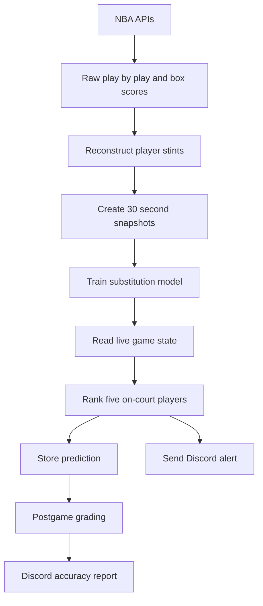

# NBA Substitution Prediction V2

An end-to-end data engineering and machine learning system that predicts which Minnesota Timberwolves player is most likely to leave the court within the next 60 seconds.

The system collects NBA data, reconstructs player stints, creates training examples, trains a logistic regression model, monitors live games, stores predictions in PostgreSQL, sends Discord alerts, and grades its predictions after each game.

## Current Status

The V2 production MVP is complete and deployed on a Raspberry Pi 5.

Completed:

- Historical data collection
- Player stint reconstruction
- Full-season data validation
- Machine learning training
- Chronological validation and testing
- Comparison against a longest-stint baseline
- Historical live-game replay
- Automatic Wolves game discovery
- Live lineup reconstruction
- Live polling every 30 seconds
- Alert thresholds and cooldowns
- Persistent cooldown history
- PostgreSQL prediction storage
- Discord live alerts
- Automatic postgame processing
- Prediction grading
- Discord postgame reports
- Raspberry Pi systemd deployment
- Automated tests with GitHub Actions

Next:

- Validate the system during real preseason games
- Measure prospective live performance
- Collect 2026 to 2027 rotation data
- Retrain for the new Wolves roster
- Generate rotation and prediction graphics
- Create public analytics content for X

## How It Works



At each eligible game snapshot, the system:

1. Identifies the five Timberwolves players currently on the court.
2. Calculates each player’s current stint length.
3. Adds game context such as the quarter, clock, score difference, opponent, and location.
4. Produces one substitution probability for each player.
5. Ranks the five players by probability.
6. Sends an alert when the highest probability reaches the configured threshold.
7. Stores the prediction and all five probabilities in PostgreSQL.
8. Grades the prediction after the game.

Bench players are not scored because they cannot be substituted out.

## Prediction Definition

The live model predicts:

> Will this player leave the court within the next 60 seconds?

The system makes one overall decision per snapshot:

- `YES` when the highest player probability reaches the alert threshold
- `NO` when no player reaches the threshold

Current alert threshold:

```text
38%
```

The model does not make predictions during the final two minutes of a period because those situations were excluded from the current training dataset.

## Model Performance

The model was trained and evaluated using a chronological split. Future games were not allowed to influence training predictions for earlier games.

### Player-level test metrics

| Metric | Result |
|---|---:|
| Player ROC AUC | 0.8083 |
| Player average precision | 0.3227 |
| Substitution precision | 0.6304 |
| Substitution recall | 0.3826 |
| Substitution F1 | 0.4762 |
| Top-player accuracy | 0.6253 |
| Correct alert and player precision | 0.4478 |
| Alert rate | 0.2199 |

Interpretation:

- About 63% of threshold alerts occurred before a substitution.
- The model detected about 38% of substitution opportunities.
- The top-ranked player was correct about 63% of the time when at least one player exited within 60 seconds.
- The model crossed its alert threshold on about 22% of eligible snapshots.

## Production Alert Replay

The complete production alert logic was replayed across 13 held-out test games.

This replay included:

- The 38% model threshold
- A 90-second global cooldown
- A 240-second same-player cooldown
- The same 30-second snapshot interval used by the live system

| Metric | Result |
|---|---:|
| Test games | 13 |
| Raw threshold alerts | 230 |
| Alerts after cooldowns | 72 |
| Average alerts per game | 5.54 |
| Correct substitution alerts | 44 |
| Correct exact-player alerts | 32 |
| Substitution precision | 61.1% |
| Exact-player precision | 44.4% |

These are historical replay results. Prospective performance during real 2026 to 2027 games still needs to be measured.

## Baseline Comparison

The machine learning model was compared against a simple basketball rule:

> Predict that the player with the longest current stint will leave next.

The longest-stint threshold was selected using validation games to produce approximately the same alert volume as the machine learning model. Both strategies were then evaluated on the untouched test games.

### Player-level comparison

| Strategy | ROC AUC | Average precision |
|---|---:|---:|
| Machine learning | 0.8083 | 0.3227 |
| Current stint only | 0.7935 | 0.2672 |

### Exact-player ranking

Measured on snapshots where at least one player exited within 60 seconds:

| Strategy | Accuracy |
|---|---:|
| Machine learning | 62.5% |
| Longest stint | 51.5% |

Longest-stint ties received fractional credit.

### Matched alert strategy comparison

| Metric | Machine learning | Longest stint |
|---|---:|---:|
| Test alerts after cooldowns | 72 | 58 |
| Average alerts per game | 5.54 | 4.46 |
| Substitution precision | 61.1% | 46.6% |
| Exact-player precision | 44.4% | 24.1% |

The machine learning model improved:

- Exact-player ranking by 11.0 percentage points
- Substitution alert precision by 14.6 percentage points
- Exact-player alert precision by 20.3 percentage points

Current stint length is a strong predictor, but the complete model provides meaningful additional value by using player identity and game context.

Run the comparison with:

```bash
python -m src.modeling.compare_baselines
```

## Training Data

Current dataset:

- Team: Minnesota Timberwolves
- Season: 2025 to 2026 regular season
- Games: 82
- Player snapshot rows: 32,920
- Five-player snapshots: 6,584
- Snapshot interval: 30 seconds
- Prediction horizon: 60 seconds

Historical validation confirmed:

- All 82 games contained play-by-play data
- All 82 games contained box score data
- All 82 games produced player stints
- Calculated minutes differed from official box scores by no more than one second
- Every training snapshot contained exactly five players
- Player stint segment totals matched complete stint totals
- No games required exclusion

## Model Features

The live model currently uses:

```text
period
seconds_remaining
current_stint_seconds
stint_number
started_period
started_game
is_home
score_diff
abs_score_diff
player_id
opponent
```

The model is a logistic regression pipeline with numeric preprocessing and one-hot categorical encoding.

Unknown players and opponents are handled without crashing, but predictions for new players are less personalized until the model is retrained.

The saved live model is:

```text
models/substitution_live_v1.joblib
```

Model files are ignored by Git and must be trained or transferred separately.

## Technology

- Python
- pandas
- scikit-learn
- nba_api
- pbpstats
- PostgreSQL 16
- Docker Compose
- Discord webhooks
- Raspberry Pi 5
- systemd
- pytest
- GitHub Actions

## Project Structure

```text
.github/
    workflows/
        tests.yml

deploy/
    systemd/
        nba-substitution-live.service
        nba-substitution-live.timer

models/
    substitution_live_v1.joblib

sql/
    v2/
        001_create_schemas.sql
        002_create_core_tables.sql
        003_create_raw_tables.sql
        004_create_analytics_tables.sql
        005_add_boxscore_lineup_fields.sql
        006_create_training_view.sql
        007_create_context_training_view.sql
        008_create_live_training_view.sql
        009_create_live_prediction_tables.sql
        010_create_live_alert_history.sql
        011_create_prediction_evaluations.sql

src/
    collect/
        load_players.py
        load_games.py
        load_play_by_play.py
        load_boxscores.py

    processing/
        build_player_stints_v2.py

    pipeline/
        run_game.py
        backfill_season.py

    modeling/
        train_baseline.py
        train_validated_model.py
        train_live_model.py
        compare_baselines.py
        predict_snapshot.py

    live/
        find_game.py
        read_state.py
        predict_live.py
        alert_memory.py
        prediction_store.py
        poll_game.py
        watch_today.py
        replay_game.py
        replay_test_period.py
        grade_game.py

    notify/
        send_discord_alert.py
        send_discord_postgame.py

    config.py
    nba_http.py

tests/
    test_alert_memory.py

requirements.txt
requirements-dev.txt
```

## Database Architecture

### Core schema

| Table | Purpose |
|---|---|
| `core.games` | Game dates, seasons, teams, and matchups |
| `core.players` | NBA player identities |
| `core.excluded_games` | Games intentionally excluded from processing |

### Raw schema

| Table | Purpose |
|---|---|
| `raw.play_by_play` | NBA play-by-play events |
| `raw.player_boxscores` | Official player minutes and starter information |
| `raw.player_rotations` | Optional raw rotation endpoint data |

### Analytics schema

| Object | Purpose |
|---|---|
| `analytics.player_stints` | Continuous periods when a player is on the court |
| `analytics.player_stint_segments` | Stints divided across individual periods |
| `analytics.substitution_training_examples_v` | Base 120-second training snapshots |
| `analytics.substitution_training_context_v` | Training snapshots with score context |
| `analytics.substitution_live_training_v` | Live 60-second training target |
| `analytics.live_predictions` | One row per stored live snapshot |
| `analytics.live_prediction_players` | Five player probabilities per snapshot |
| `analytics.live_alert_history` | Delivered alerts used for persistent cooldowns |
| `analytics.live_prediction_evaluations` | Postgame results for stored predictions |

## Local Setup

### Requirements

- Python 3.12 or newer
- Git
- Docker
- Docker Compose

### Clone and activate on Windows Git Bash

```bash
git clone https://github.com/philipvu-13/nba-substitution-prediction.git
cd nba-substitution-prediction
git switch rebuild-v2

python -m venv venv
source venv/Scripts/activate
python -m pip install -r requirements.txt
```

Install development dependencies:

```bash
python -m pip install -r requirements-dev.txt
```

### Linux and Raspberry Pi

```bash
python3 -m venv venv
source venv/bin/activate
python -m pip install -r requirements.txt
```

### Environment variables

Create `.env`:

```env
DB_HOST=localhost
DB_PORT=5433
DB_NAME=minnesota_subs_v2
DB_USER=postgres
DB_PASSWORD=your_database_password
DISCORD_WEBHOOK_URL=your_private_discord_webhook
```

Never commit `.env`.

The Raspberry Pi uses its existing PostgreSQL configuration and port `5432`.

## Database Setup

Start PostgreSQL:

```bash
docker compose up -d postgres
```

Create `minnesota_subs_v2`, then apply every migration:

```bash
for migration in sql/v2/*.sql
do
    echo "Applying $migration"

    docker compose exec -T postgres \
        psql \
        -v ON_ERROR_STOP=1 \
        -U postgres \
        -d minnesota_subs_v2 \
        < "$migration"
done
```

## Historical Pipeline

Load NBA players:

```bash
python -m src.collect.load_players
```

Load the Wolves game schedule:

```bash
python -m src.collect.load_games \
    --season 2025-26 \
    --season-type "Regular Season"
```

Process one game:

```bash
python -m src.pipeline.run_game 0022500089
```

Run a resumable season backfill:

```bash
python -m src.pipeline.backfill_season \
    --season 2025-26 \
    --season-type "Regular Season" \
    --delay 3
```

The backfill skips completed games and records failures without deleting valid data.

## Model Training

Train the original baseline model:

```bash
python -m src.modeling.train_baseline
```

Train the temporally validated model:

```bash
python -m src.modeling.train_validated_model
```

Train the 60-second production model:

```bash
python -m src.modeling.train_live_model
```

The live model is written to:

```text
models/substitution_live_v1.joblib
```

## Model Evaluation

Compare the model with the longest-stint baseline:

```bash
python -m src.modeling.compare_baselines
```

Replay the production alert system across every held-out test game:

```bash
python -m src.live.replay_test_period
```

Replay one historical game:

```bash
python -m src.live.replay_game 0022501004
```

## Historical Snapshot Testing

Replay a historical prediction:

```bash
python -m src.modeling.predict_snapshot \
    0022501004 \
    --period 1 \
    --clock 06:00
```

Test reconstructed live state:

```bash
python -m src.live.read_state \
    0022501004 \
    --period 1 \
    --clock 06:00
```

Test the live prediction path:

```bash
python -m src.live.predict_live \
    0022501004 \
    --period 1 \
    --clock 06:00
```

Test polling and store the prediction:

```bash
python -m src.live.poll_game \
    0022501004 \
    --period 1 \
    --clock 03:30 \
    --store
```

Grade stored predictions:

```bash
python -m src.live.grade_game 0022501004
```

## Live Operation

Find today’s Wolves game:

```bash
python -m src.live.find_game
```

Watch today’s game without Discord:

```bash
python -m src.live.watch_today
```

Watch today’s game with Discord:

```bash
python -m src.live.watch_today --discord
```

The watcher:

1. Finds today’s Wolves game.
2. Registers it in PostgreSQL.
3. Sleeps efficiently while tipoff is far away.
4. Checks the scoreboard more frequently near tipoff.
5. Starts live predictions when the game becomes active.
6. Polls for new game states every 30 seconds.
7. Stores predictions in PostgreSQL.
8. Applies persistent alert cooldowns.
9. Sends approved Discord alerts.
10. Detects when the game becomes final.
11. Runs the final data pipeline.
12. Grades stored predictions.
13. Sends a Discord postgame report.
14. Stops after postgame processing completes.

## Alert Controls

Current cooldowns:

```text
Global alert cooldown: 90 seconds
Same-player cooldown: 240 seconds
```

Delivered alerts are saved in:

```text
analytics.live_alert_history
```

This prevents duplicate alerts even if the Python process or Raspberry Pi restarts during a game.

## Discord

Test the Discord connection:

```bash
python -m src.notify.send_discord_alert
```

Discord delivery must be enabled explicitly:

```text
--discord
```

This prevents historical tests from accidentally sending notifications.

The project sends two types of Discord messages:

- Live substitution alerts
- Postgame accuracy reports

## Automated Tests

Run the tests locally:

```bash
python -m pytest -v
```

The GitHub Actions workflow automatically runs the test suite whenever changes are pushed to `rebuild-v2` or `main`.

Current tests cover:

- First-alert approval
- Global cooldown suppression
- Different-player alerts
- Same-player cooldown suppression
- Same-player alert approval after cooldown

## Raspberry Pi Deployment

Production directory:

```text
/home/unclephil/nba-substitution-prediction-v2
```

The Pi reuses the existing `nba_postgres` container and connects through:

```text
localhost:5432
```

Install the systemd files:

```bash
sudo install \
    -m 644 \
    deploy/systemd/nba-substitution-live.service \
    /etc/systemd/system/nba-substitution-live.service

sudo install \
    -m 644 \
    deploy/systemd/nba-substitution-live.timer \
    /etc/systemd/system/nba-substitution-live.timer
```

Enable the timer:

```bash
sudo systemctl daemon-reload
sudo systemctl enable --now nba-substitution-live.timer
```

Check its schedule:

```bash
systemctl list-timers \
    nba-substitution-live.timer \
    --all
```

View recent logs:

```bash
journalctl \
    -u nba-substitution-live.service \
    -n 100 \
    --no-pager
```

Follow logs during a game:

```bash
journalctl \
    -u nba-substitution-live.service \
    -f
```

Manually start the watcher:

```bash
sudo systemctl start nba-substitution-live.service
```

Stop it:

```bash
sudo systemctl stop nba-substitution-live.service
```

The timer runs:

- Two minutes after each Pi reboot
- Every day at 9:00 AM local time

An inactive service is normal on a day without a Timberwolves game. The timer remains active and starts it again at the next scheduled time.

## Updating the Raspberry Pi

Push changes from the development PC:

```bash
git add .
git commit -m "Describe the change"
git push
```

Update the Pi:

```bash
cd ~/nba-substitution-prediction-v2
sudo systemctl stop nba-substitution-live.service
git pull --ff-only
```

If dependencies changed:

```bash
source venv/bin/activate
python -m pip install -r requirements.txt
```

Apply any new SQL migration before restarting the service.

Restart when necessary:

```bash
sudo systemctl start nba-substitution-live.service
```

## Important Design Decisions

### Why pbpstats is used

The NBA `GameRotation` endpoint repeatedly returned empty HTTP 500 responses. The project therefore uses `pbpstats` EnhancedPbp data to reconstruct lineups and substitutions.

### Why box scores are collected

Official box score minutes provide an independent validation target. Reconstructed player stint totals must match official minutes before a game is considered complete.

### Why chronological splitting is used

Randomly mixing snapshots from every game could allow future rotation patterns to influence earlier training examples.

Games are divided chronologically into training, validation, and testing periods.

### Why the threshold is 38%

The threshold was selected using validation data with a minimum target precision requirement. A higher threshold produces fewer alerts but reduces false alarms.

### Why the longest-stint baseline matters

A player who has remained on the court for a long time is naturally more likely to leave soon.

Comparing the model against this rule tests whether machine learning adds information beyond an obvious basketball assumption. The historical test showed that the complete model meaningfully improved both substitution timing and exact-player identification.

## Known Limitations

- The model currently supports only the Timberwolves.
- It was trained using one regular season.
- Real prospective accuracy has not been measured.
- Predictions are skipped during the final two minutes of periods.
- The roster has changed since the training season.
- New players receive less personalized predictions until retraining.
- NBA endpoints may occasionally throttle, fail, or change.
- The model predicts who exits, not who enters.
- The model does not directly use injuries, foul trouble, timeouts, coach comments, or possession-level events.
- Logistic regression captures relatively simple relationships compared with more advanced models.

## V2 Remaining Work

Before V2 is considered fully validated:

1. Run the system during preseason games.
2. Confirm live API reliability and Discord timing.
3. Measure predictions made prospectively.
4. Collect early 2026 to 2027 rotation data.
5. Retrain after enough games from the new roster are available.
6. Generate public-facing analytics graphics.

## Possible V3 Features

Potential future improvements:

- Multiple NBA teams
- Prediction of the incoming player
- Three-minute public-content predictions
- Automated X graphics
- Automatic X publishing
- Additional basketball context features
- Gradient boosting or other model families
- Recency-weighted training
- Automated retraining
- Monitoring dashboard
- Web application

## Development Branch

Active rebuild branch:

```text
rebuild-v2
```

Do not merge into `main` until prospective live testing and final verification are complete.