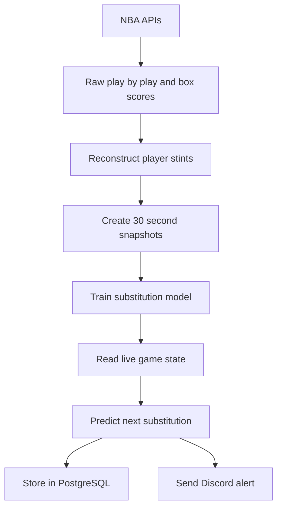

# NBA Substitution Prediction V2

A data pipeline and machine learning system that predicts which Minnesota Timberwolves player is most likely to leave the court within the next 60 seconds.

The system collects NBA play by play data, reconstructs player stints, trains a logistic regression model, monitors live games, stores predictions in PostgreSQL, and sends approved alerts to Discord.

## Current Status

The V2 live MVP is complete and deployed on a Raspberry Pi 5.

Completed:

- Historical data collection
- Player stint reconstruction
- Full season validation
- Model training and temporal testing
- Historical snapshot prediction
- Live game state reconstruction
- Automatic Wolves game discovery
- Live polling every 30 seconds
- Alert thresholds and cooldowns
- PostgreSQL prediction storage
- Discord notifications
- Raspberry Pi systemd deployment

Next:

- Validate the system during real preseason and regular season games
- Measure live alert accuracy
- Make cooldowns persist across restarts
- Retrain using 2026 to 2027 data
- Build charts and dashboard outputs

## How It Works



At each eligible game snapshot, the system:

1. Identifies the five Timberwolves players on the court.
2. Calculates each player’s current stint length.
3. Adds game context such as clock, score difference, opponent, and location.
4. Produces one substitution probability for each on court player.
5. Selects the player with the highest probability.
6. Sends an alert when the highest probability reaches the configured threshold.

Bench players are not scored because they cannot be substituted out.

## Prediction Definition

The live model predicts:

> Will this player leave the court within the next 60 seconds?

The system makes one overall decision per snapshot:

- `YES` when the highest player probability reaches the alert threshold
- `NO` when no player reaches the threshold

Current alert threshold:

```text
38%
```

The model does not make predictions during the final two minutes of a period because those situations were excluded from the current training dataset.

## Latest Test Metrics

The model was trained and evaluated using a chronological split, preventing future games from leaking into earlier training data.

| Metric | Result |
|---|---:|
| Player ROC AUC | 0.8083 |
| Player average precision | 0.3227 |
| Substitution precision | 0.6304 |
| Substitution recall | 0.3826 |
| Substitution F1 | 0.4762 |
| Top player accuracy | 0.6253 |
| Correct alert and player precision | 0.4478 |
| Alert rate | 0.2199 |

Interpretation:

- About 63% of substitution alerts occurred before a real substitution.
- The model detected about 38% of real substitution opportunities.
- The top ranked player was correct about 63% of the time when a substitution occurred.
- The system alerts on about 22% of eligible snapshots.

These are historical test results. Real live performance still needs to be measured.

## Training Data

Current dataset:

- Team: Minnesota Timberwolves
- Season: 2025 to 2026 regular season
- Games: 82
- Player snapshot rows: 32,920
- Five player snapshots: 6,584
- Snapshot interval: 30 seconds
- Prediction horizon: 60 seconds

Historical validation confirmed:

- All 82 games contained play by play data
- All 82 games contained box score data
- All 82 games produced player stints
- Calculated minutes differed from official box scores by no more than one second
- Every training snapshot contained exactly five players
- Player stint segment totals matched complete stint totals

## Model Features

The live model currently uses:

```text
period
seconds_remaining
current_stint_seconds
stint_number
started_period
started_game
is_home
score_diff
abs_score_diff
player_id
opponent
```

The model is a logistic regression pipeline with numeric preprocessing and categorical encoding.

The saved live model is:

```text
models/substitution_live_v1.joblib
```

Model files are ignored by Git and must be trained or transferred separately.

## Technology

- Python
- pandas
- scikit-learn
- nba_api
- pbpstats
- PostgreSQL 16
- Docker Compose
- Discord webhooks
- Raspberry Pi 5
- systemd

## Project Structure

```text
deploy/
    systemd/
        nba-substitution-live.service
        nba-substitution-live.timer

models/
    substitution_live_v1.joblib

sql/
    v2/
        001_create_schemas.sql
        002_create_core_tables.sql
        003_create_raw_tables.sql
        004_create_analytics_tables.sql
        005_add_boxscore_lineup_fields.sql
        006_create_training_view.sql
        007_create_context_training_view.sql
        008_create_live_training_view.sql
        009_create_live_prediction_tables.sql

src/
    collect/
        load_players.py
        load_games.py
        load_play_by_play.py
        load_boxscores.py

    processing/
        build_player_stints_v2.py

    pipeline/
        run_game.py
        backfill_season.py

    modeling/
        train_baseline.py
        train_validated_model.py
        train_live_model.py
        predict_snapshot.py

    live/
        find_game.py
        read_state.py
        predict_live.py
        alert_memory.py
        prediction_store.py
        poll_game.py
        watch_today.py

    notify/
        send_discord_alert.py

    config.py
    nba_http.py
```

## Database Architecture

### Core schema

| Table | Purpose |
|---|---|
| `core.games` | Game dates, seasons, teams, and matchups |
| `core.players` | NBA player identities |
| `core.excluded_games` | Games intentionally excluded from processing |

### Raw schema

| Table | Purpose |
|---|---|
| `raw.play_by_play` | NBA play by play events |
| `raw.player_boxscores` | Official player minutes and starter information |
| `raw.player_rotations` | Optional raw rotation endpoint data |

### Analytics schema

| Object | Purpose |
|---|---|
| `analytics.player_stints` | Continuous periods when a player is on the court |
| `analytics.player_stint_segments` | Stints divided across individual periods |
| `analytics.substitution_training_examples_v` | Base 120 second training snapshots |
| `analytics.substitution_training_context_v` | Training snapshots with score context |
| `analytics.substitution_live_training_v` | Live 60 second training target |
| `analytics.live_predictions` | One row per live snapshot |
| `analytics.live_prediction_players` | Five player probabilities per snapshot |

## Local Setup

### Requirements

- Python 3.12 or newer
- Git
- Docker
- Docker Compose

### Clone and activate

```bash
git clone https://github.com/philipvu-13/nba-substitution-prediction.git
cd nba-substitution-prediction
git switch rebuild-v2

python -m venv venv
source venv/Scripts/activate
python -m pip install -r requirements.txt
```

On Linux:

```bash
python3 -m venv venv
source venv/bin/activate
python -m pip install -r requirements.txt
```

### Environment variables

Create `.env`:

```env
DB_HOST=localhost
DB_PORT=5433
DB_NAME=minnesota_subs_v2
DB_USER=postgres
DB_PASSWORD=your_database_password
DISCORD_WEBHOOK_URL=your_private_discord_webhook
```

Never commit `.env`.

### Start PostgreSQL

```bash
docker compose up -d postgres
```

Create `minnesota_subs_v2`, then apply the migrations:

```bash
for migration in sql/v2/*.sql
do
    echo "Applying $migration"

    docker compose exec -T postgres \
        psql \
        -v ON_ERROR_STOP=1 \
        -U postgres \
        -d minnesota_subs_v2 \
        < "$migration"
done
```

## Historical Pipeline

Load NBA players:

```bash
python -m src.collect.load_players
```

Load the Wolves game log:

```bash
python -m src.collect.load_games \
    --season 2025-26 \
    --season-type "Regular Season"
```

Process one game:

```bash
python -m src.pipeline.run_game 0022500089
```

Run a resumable season backfill:

```bash
python -m src.pipeline.backfill_season \
    --season 2025-26 \
    --season-type "Regular Season" \
    --delay 3
```

The backfill skips completed games and records failures without deleting valid data.

## Model Training

Train the original baseline:

```bash
python -m src.modeling.train_baseline
```

Train the temporally validated model:

```bash
python -m src.modeling.train_validated_model
```

Train the 60 second live model:

```bash
python -m src.modeling.train_live_model
```

The live model is written to:

```text
models/substitution_live_v1.joblib
```

## Historical Prediction Testing

Replay a historical snapshot:

```bash
python -m src.modeling.predict_snapshot \
    0022501004 \
    --period 1 \
    --clock 06:00
```

Test the reconstructed live state:

```bash
python -m src.live.read_state \
    0022501004 \
    --period 1 \
    --clock 06:00
```

Test the live prediction path:

```bash
python -m src.live.predict_live \
    0022501004 \
    --period 1 \
    --clock 06:00
```

Test the polling command without Discord:

```bash
python -m src.live.poll_game \
    0022501004 \
    --period 1 \
    --clock 06:00
```

## Live Operation

Find today’s Wolves game:

```bash
python -m src.live.find_game
```

Watch today’s game without Discord:

```bash
python -m src.live.watch_today
```

Watch today’s game with Discord alerts:

```bash
python -m src.live.watch_today --discord
```

The watcher:

1. Finds today’s Wolves game.
2. Registers the game in PostgreSQL.
3. Sleeps efficiently while tipoff is far away.
4. Checks every minute shortly before tipoff.
5. Starts live predictions when the game becomes active.
6. Polls for new game states every 30 seconds.
7. Stores predictions in PostgreSQL.
8. Sends approved Discord alerts.
9. Stops when the game becomes final.

## Discord

Test the Discord connection:

```bash
python -m src.notify.send_discord_alert
```

Discord delivery must be enabled explicitly with:

```text
--discord
```

This prevents historical tests from accidentally sending alerts.

## Raspberry Pi Deployment

The production deployment uses:

```text
/home/unclephil/nba-substitution-prediction-v2
```

The Pi reuses the existing `nba_postgres` container and connects through:

```text
localhost:5432
```

Install the systemd files:

```bash
sudo install \
    -m 644 \
    deploy/systemd/nba-substitution-live.service \
    /etc/systemd/system/nba-substitution-live.service

sudo install \
    -m 644 \
    deploy/systemd/nba-substitution-live.timer \
    /etc/systemd/system/nba-substitution-live.timer
```

Enable the timer:

```bash
sudo systemctl daemon-reload
sudo systemctl enable --now nba-substitution-live.timer
```

Check its schedule:

```bash
systemctl list-timers \
    nba-substitution-live.timer \
    --all
```

View application logs:

```bash
journalctl \
    -u nba-substitution-live.service \
    -n 100 \
    --no-pager
```

Follow logs during a game:

```bash
journalctl \
    -u nba-substitution-live.service \
    -f
```

Manually start the watcher:

```bash
sudo systemctl start nba-substitution-live.service
```

Stop it:

```bash
sudo systemctl stop nba-substitution-live.service
```

The timer runs:

- Two minutes after each Pi reboot
- Every day at 9:00 AM local time

## Updating the Raspberry Pi

Push changes from the development PC:

```bash
git add .
git commit -m "Describe the change"
git push
```

Update the Pi:

```bash
cd ~/nba-substitution-prediction-v2
git pull --ff-only
```

If dependencies changed:

```bash
source venv/bin/activate
python -m pip install -r requirements.txt
```

Restart the application when necessary:

```bash
sudo systemctl restart nba-substitution-live.service
```

## Important Design Decisions

### Why pbpstats is used

The NBA `GameRotation` endpoint repeatedly returned empty HTTP 500 responses. The project therefore uses `pbpstats` EnhancedPbp data to reconstruct lineups and substitutions.

### Why box scores are still collected

Official box score minutes provide a validation target. Reconstructed player stint totals must match official minutes before a game is considered complete.

### Why time based data splitting is used

Randomly mixing snapshots from every game could allow future rotation patterns to influence earlier training examples. Games are split chronologically into training, validation, and testing periods.

### Why the threshold is 38%

The live threshold was selected using validation data with a minimum target precision of 65%. On the final historical test set, substitution precision was approximately 63%.

The higher threshold produces fewer alerts but reduces false alarms.

## Known Limitations

- The model currently supports only the Timberwolves.
- The model was trained on the 2025 to 2026 season.
- Real live accuracy has not been measured yet.
- Predictions are skipped during the final two minutes of periods.
- Alert cooldown memory resets if the Python process restarts.
- NBA endpoints may occasionally throttle, fail, or change.
- Newly added players may be treated as unknown categories until retraining.
- The model predicts substitution timing, not the player entering the game.
- The current model does not use injuries, foul trouble, timeouts, or coach comments directly.

## Development Branch

Active rebuild branch:

```text
rebuild-v2
```

Do not merge into `main` until live testing, documentation, and final verification are complete.